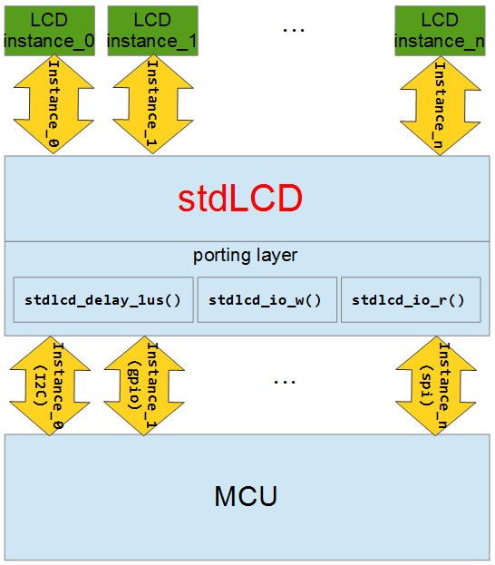

# stdLCD
The c base character type LCD library, easy to port to different platform, and provides character output API similar 'stdio'.  

You need to port 3 functions to your platform/MCU:  
1. stdlcd_delay_1us()  
2. stdlcd_io_w()  
3. stdlcd_io_r()  
these 3 functions are written in the 'stdlcd_io.c'.  

The library struct show below.  

